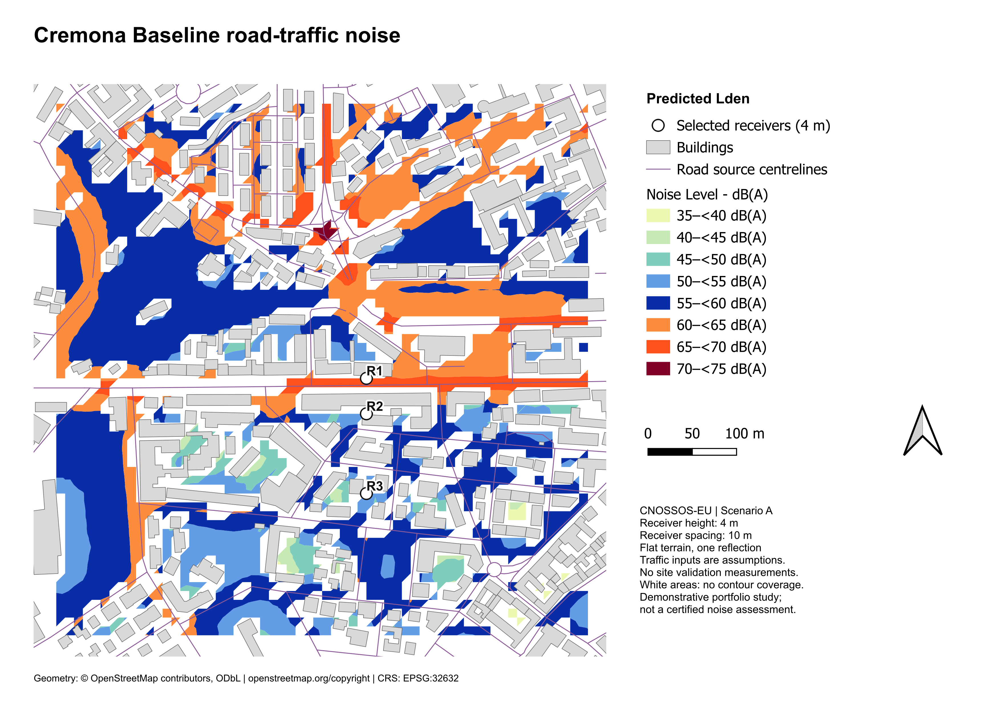
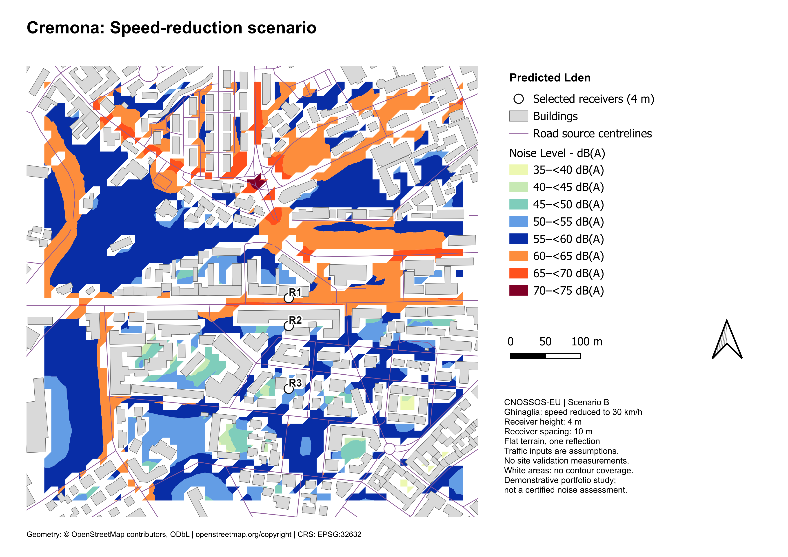
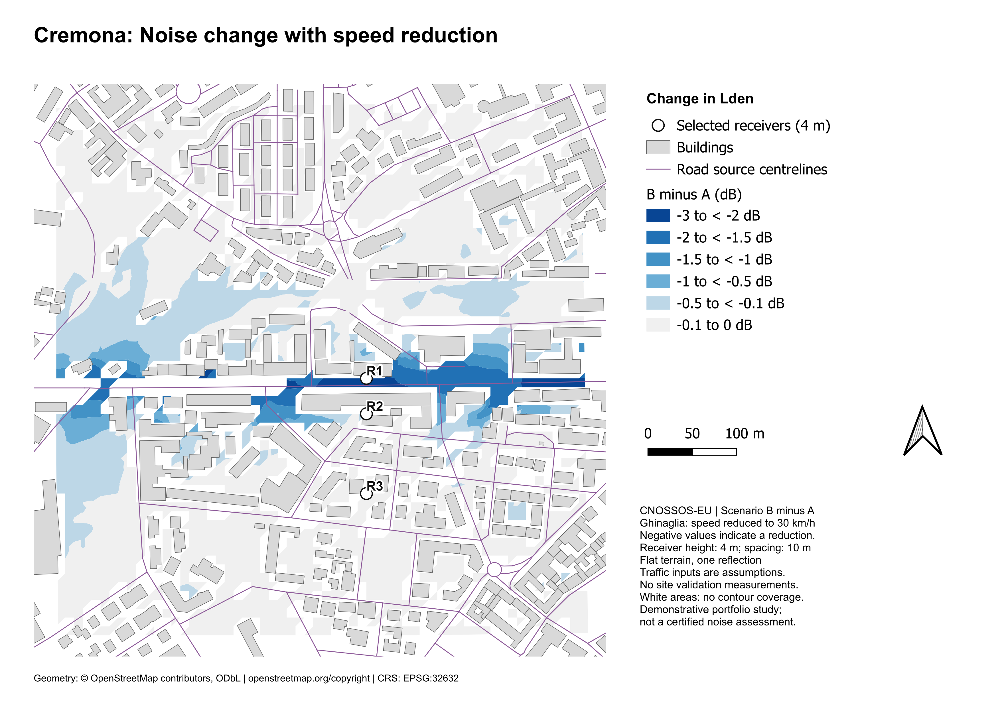
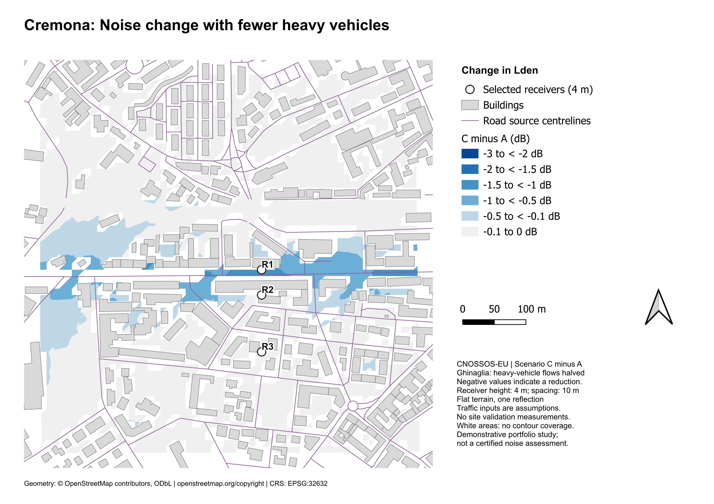
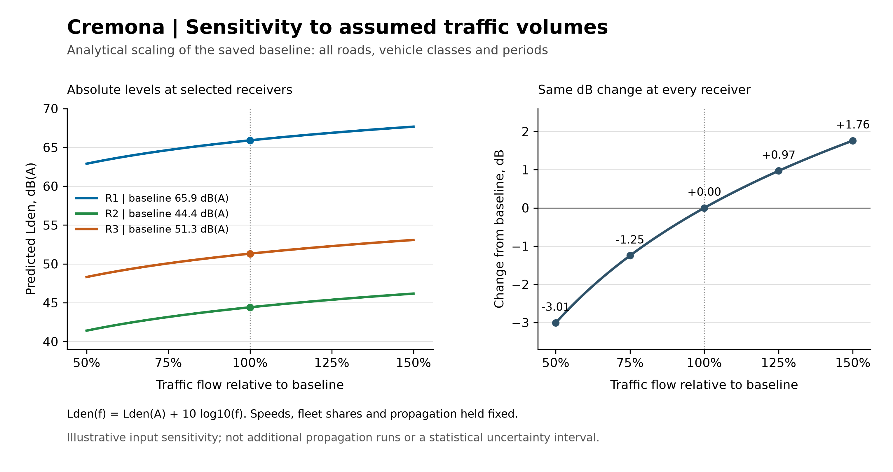

# Road Traffic Noise Mapping and Mitigation Study using CNOSSOS-EU


An independent portfolio study using **NoiseModelling 6.0.0, QGIS 3.44.14, and OpenStreetMap** to predict road-traffic noise and compare two interventions on Via Ferruccio Ghinaglia in Cremona, Italy.

The project extends my MSc work in room acoustics, impulse-response measurements and spatial acoustic mapping into environmental noise prediction. It covers input preparation, source emissions, propagation, model checks, mitigation comparison and technical reporting.

**Main finding:** at the selected roadside receiver, reducing assumed corridor speeds from 50 to 30 km/h reduced predicted Lden by **2.08 dB**. Halving corridor heavy-vehicle flows reduced it by **1.03 dB**. These are model predictions under assumed traffic conditions, not measured changes in Cremona.

[Read the complete report](Madhav_Gopi_Cremona_Noise_Study.pdf)



*Baseline Lden at 4 m receiver height. White gaps have no contour coverage and must not be interpreted as quiet areas. Geometry © OpenStreetMap contributors.*

## Engineering question

How do lower vehicle speeds and reduced heavy-vehicle flows affect predicted road-traffic noise in a small urban area with roadside buildings and spaces behind the first building row?

The reporting area is approximately **600 × 600 m**. A larger surrounding geometry extract supplies the roads and obstacles needed for the **1,000 m source search distance**. The wider input context is not the reporting area.

## Scenarios

| Scenario | Intervention on nine Ghinaglia road sections | Held fixed |
|---|---|---|
| A - Baseline | Assumed traffic with corridor speeds of 50 km/h | Reference case |
| B - Speed reduction | Light- and heavy-vehicle speeds reduced to 30 km/h | Traffic flows, geometry and propagation settings |
| C - Heavy-vehicle reduction | Heavy-vehicle flows reduced by 50% | Baseline speeds, light-vehicle flows, geometry and propagation settings |

B and C are separate alternatives. Scenario C reduces total traffic as well as the heavy-vehicle share; it does not redistribute removed vehicles to other streets. Roads outside the intervention retain baseline inputs.

## Method

```text
OSM geometry and explicit traffic assumptions
    → Road_Emission_from_Traffic
    → LW_ROADS source emissions
    → Noise_level_from_source at a common receiver grid
    → D / E / N / DEN receiver results
    → isobands, matched-receiver differences and QGIS layouts
```

| Model component | Setting |
|---|---|
| Coordinate reference system | EPSG:32632 — WGS 84 / UTM zone 32N; distances in metres |
| Road emission method | CNOSSOS-EU, coefficient version 2 (2020 set) |
| Road source height | 0.05 m |
| Receiver grid | 10 m spacing, 4 m height; 2,667 unique calculation points |
| Interpolation mesh | 3,321 triangles shared by all scenarios |
| Terrain | Flat; no digital elevation model |
| Reflections | Order 1; reflection search distance 50 m |
| Diffraction | Horizontal-edge diffraction enabled; vertical-edge diffraction disabled |
| Maximum source distance | 1,000 m |
| Wall absorption coefficient | 0.1 |
| Atmospheric assumptions | 15 °C, 70% relative humidity; favourable propagation probability 0.5 in all 16 directions |
| Road surface | CNOSSOS reference pavement DEF |

Lden is an A-weighted day–evening–night indicator. The calculation uses 12/4/8-hour periods and +5 dB evening / +10 dB night penalties, combined by sound energy. This software period convention is not presented as a certified Italian regulatory assessment.

Traffic flows originate from importer defaults. Numeric OSM speed tags are used as unverified operating-speed proxies where available; other roads use documented class-based assumptions. The report explains these choices and their limitations.

## Mitigation maps



*Scenario B. Identical colour classes allow comparison with A, although a change smaller than a 5 dB class can be difficult to see.*


*Scenario C: heavy-vehicle flow reduced by 50%.*



*B minus A. Differences are calculated from unrounded levels at matching receivers, then interpolated on the common mesh. Negative values indicate improvement; the calculation does not subtract contour-class numbers.*



*C minus A. The same difference-map colour intervals are used for both interventions.*


## Results at three representative receivers

All receivers are at 4 m height. Distances below are horizontal distances to the Ghinaglia centreline, not distances to every contributing road.

| Receiver | Position | Distance | A Lden | B Lden | C Lden | B − A | C − A |
|---|---|---:|---:|---:|---:|---:|---:|
| R1 | Roadside, north of Ghinaglia | 7.9 m | 65.9 dB(A) | 63.8 dB(A) | 64.9 dB(A) | −2.08 dB | −1.03 dB |
| R2 | Behind the first building row, south of Ghinaglia | 32.1 m | 44.4 dB(A) | 44.1 dB(A) | 44.2 dB(A) | −0.35 dB | −0.20 dB |
| R3 | Farther south, also exposed to other local roads | 122.1 m | 51.3 dB(A) | 51.3 dB(A) | 51.3 dB(A) | Reduction <0.01 dB | Reduction <0.01 dB |

Changes use unrounded results. Display precision does not imply equivalent prediction accuracy. R3 is farther from the intervention but louder than R2: distance to a single road does not explain the combined effects of a road network and buildings. This comparison does not isolate a building-screening insertion loss.

| Statistic across 2,665 outdoor receivers | B - Speed reduction | C - Heavy-vehicle reduction |
|---|---:|---:|
| Maximum predicted reduction | 2.10 dB | 1.05 dB |
| Median predicted reduction | 0.03 dB | 0.02 dB |
| Receivers with reduction ≥1 dB | 200 (7.5%) | 43 (1.6%) |

Two points above low building roofs are excluded from outdoor statistics. These statistics weight grid points equally; they are not population- or area-weighted. The two maxima occur at different receivers. The 1 dB threshold is descriptive, not a compliance or audibility threshold.

## Traffic-flow sensitivity



With every vehicle-category flow on every road and in every period multiplied by the same positive factor f, and all other inputs fixed:

**Lden(f) = Lden(A) + 10 log10(f)**

Halving traffic gives −3.01 dB; increasing traffic by 25% gives +0.97 dB. This is an analytical sensitivity calculation anchored to the actual baseline results, not additional propagation runs or a statistical confidence interval. It does not replace the separately modelled speed and heavy-vehicle scenarios.

## Quality checks and limitations

- Identical receiver positions and identifiers across A, B and C; no duplicate receiver locations.
- 2,667 receivers in each of D, E, N and DEN: 10,668 records per scenario.
- Checks of coordinate system, receiver heights, valid octave-band values and Lden consistency; invalid −99 sentinel values excluded from statistics.
- Consistent map extents, absolute-level classes and difference-map classes across scenarios.
- Traffic inputs are assumptions/defaults unless explicitly attributed to OSM tags; they are not measured Cremona traffic counts.
- No site validation measurement was performed. OSM geometry, heights and ground properties have limitations.
- Flat terrain, simplified propagation settings and finite source coverage introduce limitations; no numerical convergence study was performed.
- Railway and other non-road sources are excluded. Congestion, detailed acceleration and traffic redistribution are not modelled.
- This is a demonstrative portfolio study, not a certified regulatory noise assessment.


## Author and attribution

**Madhav Gopi | Acoustic Engineer**

Geometry © [OpenStreetMap contributors](https://www.openstreetmap.org/copyright), available under the Open Database Licence (ODbL). Retain attribution and applicable data licence terms when reusing OSM-derived material.

Software: [NoiseModelling](https://noisemodelling.readthedocs.io/en/v6.0.0/) · [QGIS](https://qgis.org/).

Tags: Environmental-noise prediction with CNOSSOS-EU; spatial data preparation and CRS management; traffic-emission modelling; receiver and output validation; controlled mitigation comparisons; QGIS cartography; engineering reporting.

Study version 1.0 | September 2026.
